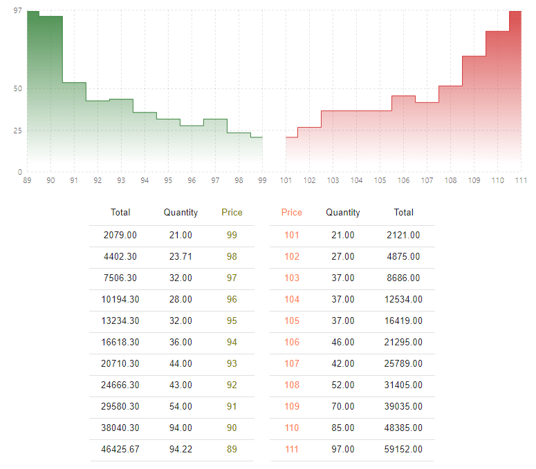
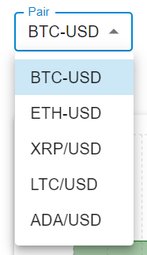
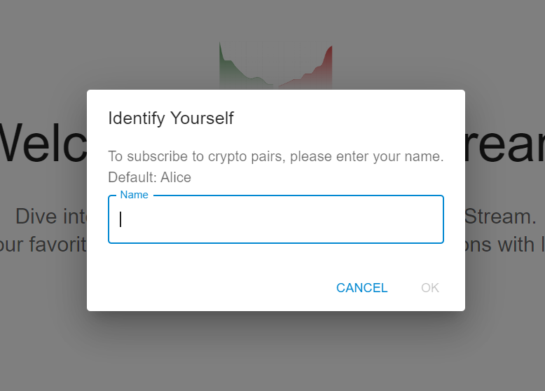
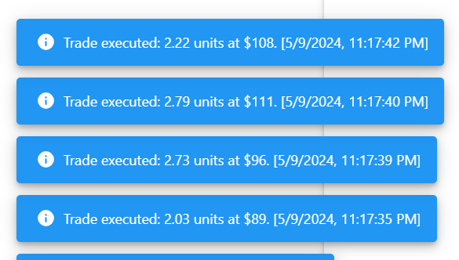

# Real-Time Order Book Updates

This documentation outlines the development and functionality of a real-time order book and trade updates application

## Overview

The application simulates a real-time trading platform where users can subscribe to updates for specific cryptocurrency pairs. It showcases backend and frontend integration for managing and broadcasting updates to order books and executed trades.

### Installation and Setup

#### Prerequisites

- Node.js
- RabbitMQ
- JSON-server

#### Setup

1. Open `/client` in terminal and run `npm run start`
2. Open `/server` in terminal and run `npm run dev`
3. Open http://localhost:3000 in a few tabs or different devices

### Key Features

- Real-Time Updates: Immediate broadcasting of changes in the order book and notifications of trade executions to subscribed clients.
- User Identification: Users identify themselves using a simple name entry to subscribe and receive updates for their chosen crypto pairs.
- Subscription Management: Users can dynamically manage their subscriptions to receive updates on selected crypto pairs.
- Mock Trading Capabilities: Users can send mock bids and asks for each subscribed crypto pair, which are processed and reflected in real-time updates.

### Technical Details

- Backend Technologies: Utilizes Node.js for server-side logic, Socket.io for managing WebSocket connections, and RabbitMQ for handling message queuing.
- Data Management: Employs JSON-server as a mock database to store and retrieve order book and trade data.
- Frontend Technologies: Developed with React, leveraging the Context API for state management and Material-UI for component styling.

## Implementation

### Backend

The backend is built with Node.js, handling incoming socket connections and managing user subscriptions. It integrates with RabbitMQ to receive and process mock data, which simulates real-time order book and trade updates. Data persistence and retrieval are handled by JSON-server, which stores the order book and trade data in a simple JSON format.

### Frontend

The frontend is developed using React. It provides a user interface where users can enter their name to subscribe to different cryptocurrency pairs, view real-time updates in order books and trades, and submit mock bids and asks. The application uses Material-UI for styling and the Context API for managing application state across different components.

### Communication

The application uses Socket.io to establish a real-time, bi-directional communication channel between the client and server. This allows the server to push updates to the client as soon as changes occur.

## Future Enhancements

- Redis Integration: To improve response times and scalability by caching frequently accessed data.
- Enhanced Security: Implementing authentication and authorization mechanisms to secure user sessions and validate actions.
- Robust Error Handling: Developing more comprehensive error handling and recovery mechanisms to ensure the application remains stable and responsive under varying conditions.

# ScreenShots

